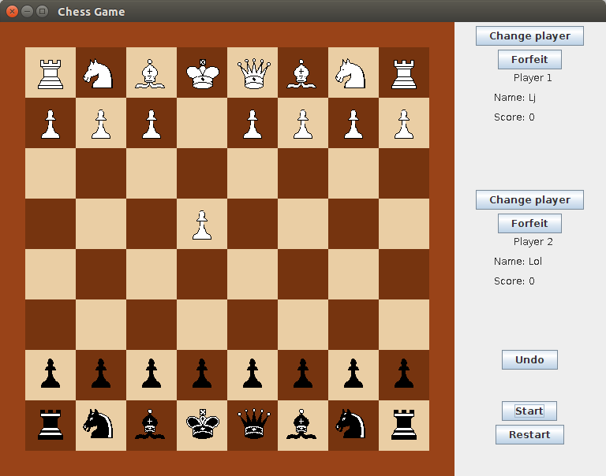

# Simple multi-player Chess Game written in Java. 

Several notable features include:
* MVC design pattern
* Comprehensive unit tests for the most part
* Usage of inheritance for less code duplication and code orthogonality

## Overview

How the game looks:

## Future Direction:

* Adding network Support for multi-players
* AI for the game
